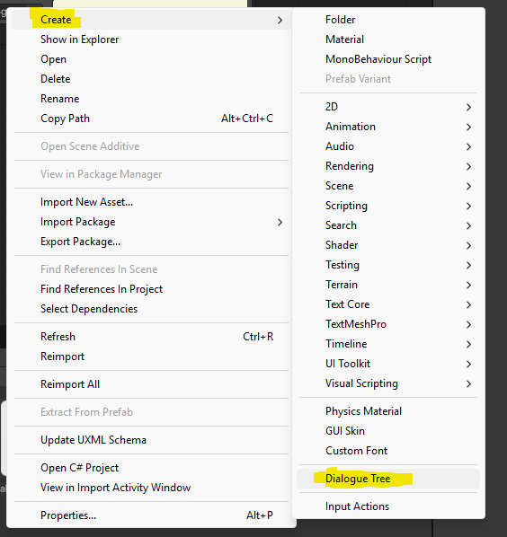
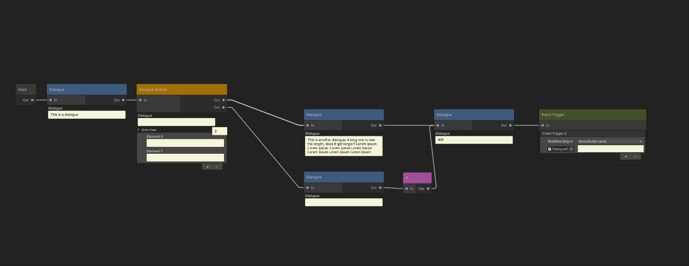

# Tutorial

This tutorial walks you from a fresh install to a playable branching dialogue.

## 1. Create a dialogue asset

In the Project window, right-click and choose **Create → Dialogue → Dialogue Tree**. Name it whatever your scene calls for (e.g. `Innkeeper.asset`).



The new asset already contains a **Start** node — the entry point for playback. You can't delete it.

## 2. Open the editor

Double-click the asset. The Dialogue Tree editor window opens. You should see the Start node sitting on the grid.



Useful controls:

| Action | How |
|---|---|
| Pan | Middle-mouse drag, or Alt + left-drag |
| Zoom | Mouse wheel |
| Add a node | Right-click empty space → pick from the menu |
| Connect ports | Click and drag from one port to another |
| Delete | Select + Delete key |
| Undo / Redo | Ctrl+Z / Ctrl+Y |

## 3. Create an Actor (optional but recommended)

Actors carry the speaker's name, color, and portrait so the runtime UI can show *who* is talking.

1. **Create → Dialogue → Actor**.
2. Fill in `actorName`, pick a tint `actorColor`, and drop a `Sprite` into `actorIcon`.

You can make as many as you need (one per character).

## 4. Add a Dialogue node

Right-click the canvas → **Dialogue → Dialogue**. A new node appears.

On the node:

- **Actor** — drag your Actor asset here. The node header tints to the actor's color and the portrait shows up.
- **Dialogue** — the line of text the actor will say.

Now drag from the Start node's output port to this node's input port. You've just authored a one-line conversation.

## 5. Add a branching choice

Right-click → **Dialogue → Branch**. The Branch node has a list of **Choices** in the body — one entry per option you want to give the player. Adding a choice automatically adds a matching output port.

1. Add two choices, e.g. *"Tell me more"* and *"Goodbye"*.
2. Create two more **Dialogue** nodes for the two follow-up lines.
3. Connect output 0 of the Branch to the first follow-up, output 1 to the second.

> **Note:** `DialogueBranch` is still flagged experimental. It works, but the API may change.

## 6. Trigger gameplay events

Right-click → **Actions → Event Trigger**. Type a string into **EventTriggerName** (e.g. `give_item_potion`).

At runtime, the dialogue object will raise its `OnEventTriggered` C# event with that string when playback reaches the node. Your game code subscribes and acts on it — open a shop, give an item, start a quest, whatever.

## 7. Hook it up in a scene

1. Create a GameObject in your scene (e.g. `DialogueRunner`).
2. Add a **`DialogueTreeGraphObject`** component to it.
3. Drag your dialogue asset into the **Dialogue Tree Asset** field.

That's enough to play the dialogue — but you still need UI to display it.

## 8. Display the dialogue in UI

Subscribe to `DialogueGraphNode.DialogueUpdated` somewhere in your UI script. The event fires every time playback enters a node that produces text.

```csharp
using UnityEngine;
using UnityEngine.UIElements;
using DTNE.DialogueTreeNodeEditor.Runtime;
using DTNE.DialogueTreeNodeEditor.Runtime.ScriptableObjects;

public class DialogueUI : MonoBehaviour
{
    [SerializeField] private UIDocument uiDocument;
    public DialogueTreeGraphObject dialogue;

    private VisualElement _root;
    private Label _textBox;
    private Button _continueButton;
    private VisualElement _choicesContainer;

    void Awake()
    {
        _root = uiDocument.rootVisualElement;
        _textBox = _root.Q<Label>("textBox");
        _continueButton = _root.Q<Button>("continueButton");
        _choicesContainer = _root.Q<VisualElement>("choicesContainer");
    }

    void OnEnable()
    {
        _continueButton.clicked += () => dialogue.MoveToNextNode(0);

        DialogueGraphNode.DialogueUpdated += (_, e) =>
        {
            _textBox.text = e.Actor != null
                ? $"{e.Actor.actorName}: {e.Dialogue}"
                : e.Dialogue;

            _choicesContainer.Clear();
            if (e.Choices == null || e.Choices.Count == 0) return;

            // Hide continue button while waiting on a choice.
            _continueButton.style.display = DisplayStyle.None;

            for (int i = 0; i < e.Choices.Count; i++)
            {
                int choiceIndex = i; // capture
                var btn = new Button { text = e.Choices[i] };
                btn.clicked += () =>
                {
                    _continueButton.style.display = DisplayStyle.Flex;
                    dialogue.MoveToNextNode(choiceIndex);
                };
                _choicesContainer.Add(btn);
            }
        };
    }
}
```

A drop-in version of this script ships with the **Dialogue Samples** package sample — import it via Package Manager.

## 9. React to event-trigger nodes

```csharp
void OnEnable()
{
    dialogue.OnEventTriggered += HandleEvent;
}

void HandleEvent(string eventName)
{
    switch (eventName)
    {
        case "give_item_potion":
            inventory.Add(potionItem);
            break;
    }
}
```

## 10. Press play

You should see the first dialogue line, click **Continue** to advance, and pick a branch when the choices show up.

## Tips & gotchas

- **The Start node is mandatory.** Every graph needs exactly one — it's seeded automatically and can't be deleted.
- **Output ports are single-capacity.** One output can drive one input. Use a Branch node if you need fan-out.
- **Event Trigger nodes auto-advance.** They have no UI beat — playback steps past them on the same frame.
- **`IfConditionNode` is a stub.** It is not yet wired up to a variable system, so it's hidden from the create menu.
- **Actor portraits not showing up?** Make sure the Actor's `actorIcon` field is assigned. As of 0.1.9 the portrait survives reopening the asset.

## What's next

- Add custom node types — see the **Authoring custom nodes** section in the [README](../README.md).
- Import the **Dialogue Samples** sample from Package Manager for a complete UI Toolkit setup.
- File issues and ideas at [github.com/CgViking/DialogueTreeNodeEditor/issues](https://github.com/CgViking/DialogueTreeNodeEditor/issues).